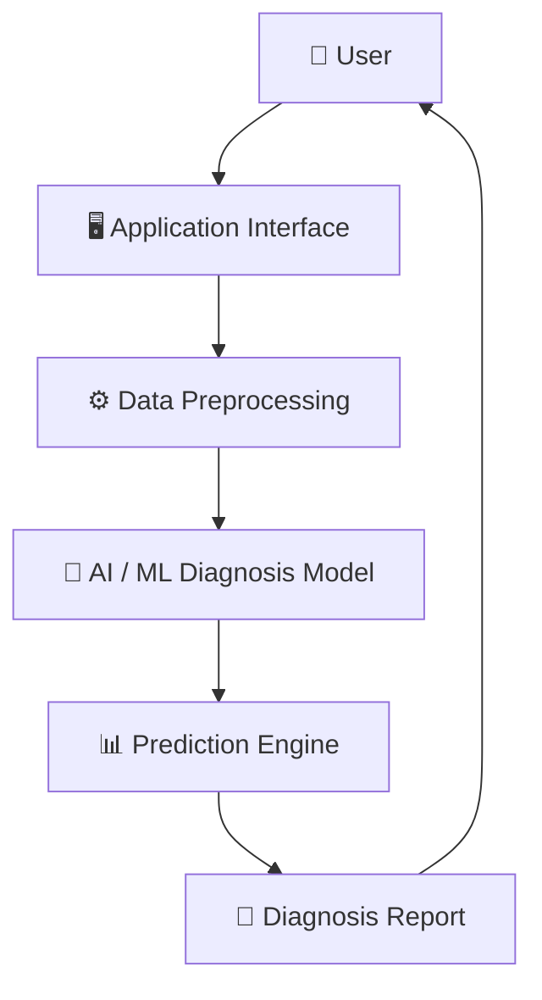
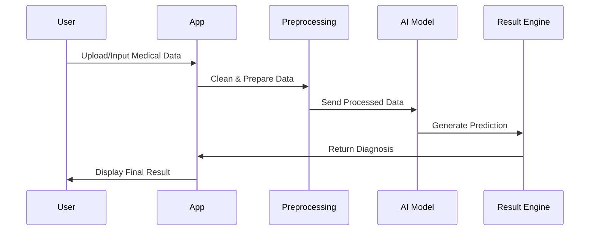
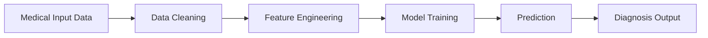

# 🩺 Medical Diagnosis Project

AI-powered medical diagnosis system built with Machine Learning and Deep Learning techniques for intelligent disease prediction and medical analysis.

---

## 🚀 Features

- Medical diagnosis prediction
- Deep Learning / AI-based analysis
- Modular project architecture
- Clean separation between application and core logic
- Scalable backend structure
- Easy deployment and extension
- Configurable environment
- Production-ready structure

---

## 📂 Project Structure

```bash
Medical-Diagnosis-Project/
│
├── app/                  # Application entry points / UI
├── src/                  # Core source code
├── requirements.txt      # Project dependencies
├── README.md             # Project documentation
└── .gitignore
```

---

# 🏗️ Architecture Overview



---

# 🔬 System Workflow



---

# 🧠 AI Pipeline



---

# ⚡ Installation

## 1️⃣ Clone Repository

```bash
git clone https://github.com/ahmedayad0168/Medical-Diagnosis-Project.git

cd Medical-Diagnosis-Project
```

---

## 2️⃣ Create Virtual Environment

### Windows

```bash
python -m venv venv

venv\Scripts\activate
```

### Linux / Mac

```bash
python3 -m venv venv

source venv/bin/activate
```

---

## 3️⃣ Install Dependencies

```bash
pip install -r requirements.txt
```

---

# ▶️ Run Project

```bash
python app/main.py
```

---

# 📊 Technologies Used

- Python
- Machine Learning
- Deep Learning
- TensorFlow / PyTorch
- NumPy
- Pandas
- Scikit-learn
- OpenCV

---

# 📈 Future Improvements

- Add medical image segmentation
- Add multi-disease classification
- Improve model accuracy
- Add explainable AI (XAI)
- Add cloud deployment
- Add API integration
- Add real-time monitoring

---

# 🔒 Disclaimer

This project is developed for educational and research purposes only.

It is NOT intended for real-world clinical or medical use.

Always consult professional healthcare providers for medical decisions.

---

# 👨‍💻 Author

## Ahmed Ayad

AI & Data Science Student  
Faculty of Computers and Artificial Intelligence

GitHub:
https://github.com/ahmedayad0168

---

# ⭐ Support

If you like this project:

- Star the repository
- Fork the project
- Contribute improvements
