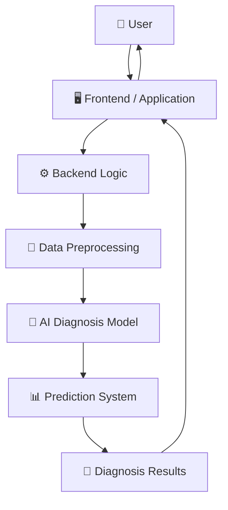
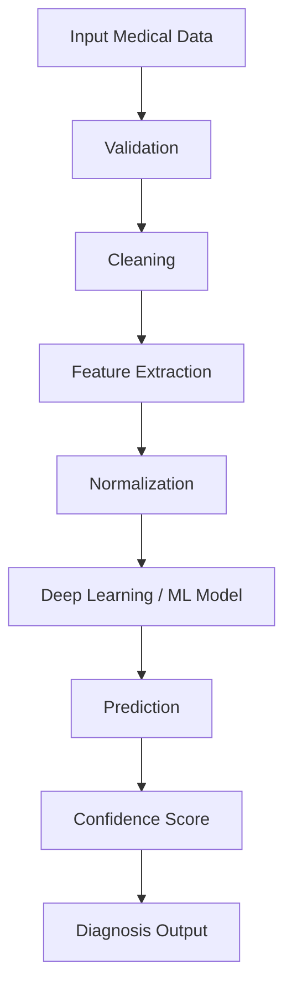
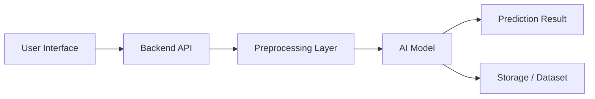
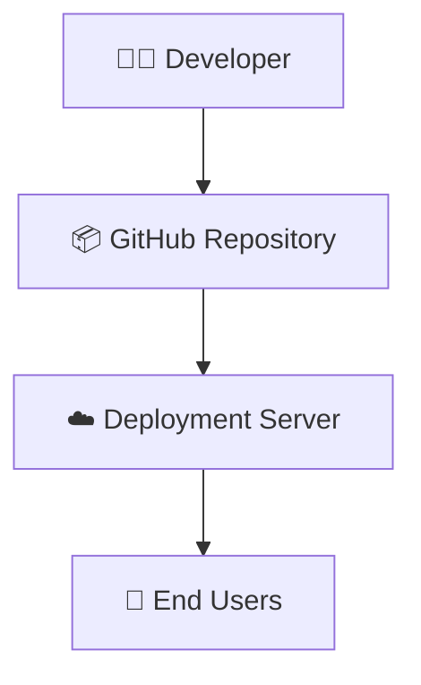
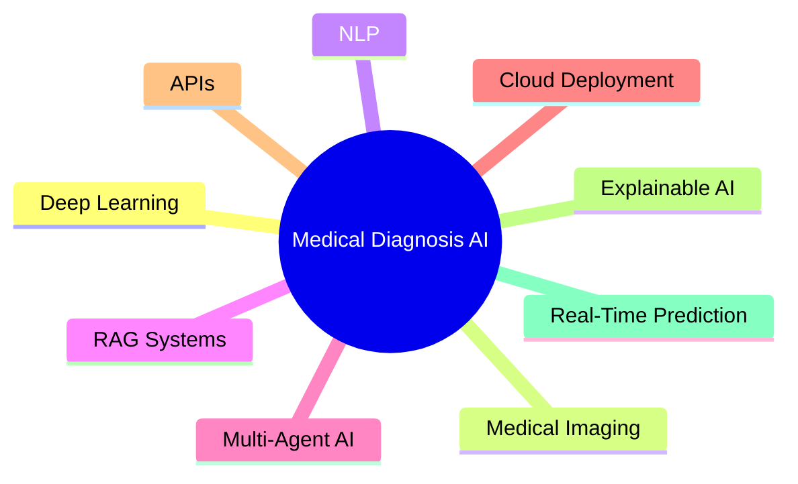

# 🏗️ Medical Diagnosis Project Architecture

---

# High-Level Architecture

---

# Detailed AI Workflow

---

# Component Architecture

---

# Deployment Architecture

---

# Scalability Vision

